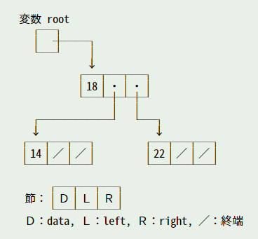

## [Two Sum](Two_sum.py)
整数numsの配列と整数targetが与えられたとき、targetに加算されるような2つの数値のインデックスを返す。
各入力には正確に1つの解があると仮定し、同じ要素を2回使用することはできません。
答えはどのような順序でも返せます。
### Example
- Example 1
```py
Input: nums = [2,7,11,15], target = 9
Output: [0,1]
# 理由： nums[0] + nums[1] == 9 なので、return は [0, 1] である。
```
### 解説
- [リンク](https://leetcode.com/problems/two-sum/)


## [Symmetric Tree](SymmeticTree.py)
二分木```root```が与えられたとき、それが自分自身の鏡であるかどうか（左右対称であるかどうか）を調べます。
- 制約
    - ツリーのノード数は、[1, 1000]の範囲内です。
    - ```-100 <= Node.val <= 100```
### Example
- Example 1

```py
Input: root = [1,2,2,3,4,4,3]
Output: true
```
- Example 2

```py
Input: root = [1,2,2,null,3,null,3]
Output: false
```
### 解説
#### 節の定義
- 最初に、節を表すクラスを定義する
    - 節を参照する変数が 2 つ必要になる。left が左側の子、right が右側の子を表す。
    - 子を持たない場合は、None をセット
```py
class TreeNode:
    def __init__(self, val=0, left=None, right=None): # コンストラクタ
        self.val = val #ノードがもつ数値
        self.left = left # 左の子
        self.right = right # 右の子
```


#### データの探索

- [リンク](https://leetcode.com/problems/symmetric-tree/)

## markdown 記述例
- 画像


